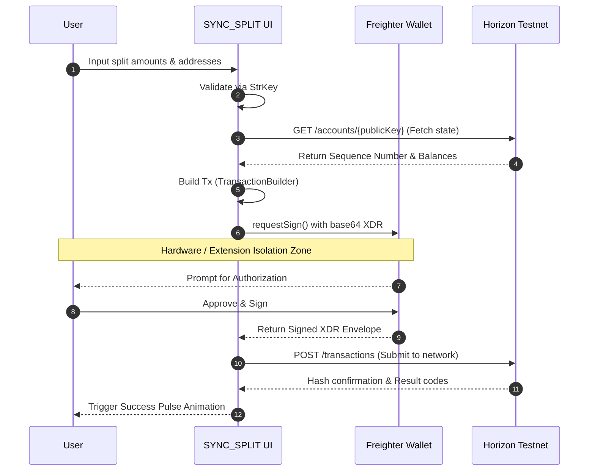

<div align="center">
  <br />
  <h1>SYNC_SPLIT PROTOCOL</h1>
  <p>
    <strong>Cryptographic precision for splitting bills on the Stellar Network.</strong>
  </p>
  
  <p>
    
    
    
  </p>
  <br />
</div>

> **SYNC_SPLIT** is a production-grade Web3 application designed to seamlessly divide expenses using XLM on the Stellar Testnet. Embracing a "Kinetic Midnight" aesthetic, the interface utilizes custom glassmorphism, fluid animations, and tonal boundary mapping to deliver a native, next-generation decentralized experience.

---

### System Architecture

The application operates entirely on the client side, leveraging the robust, open-source infrastructure of the Stellar Development Foundation to ensure full decentralization and reliability.

```mermaid
graph TD
    classDef client fill:#7c3aed,stroke:#d2bbff,stroke-width:2px,color:#fff;
    classDef wallet fill:#fbabff,stroke:#ae05c6,stroke-width:2px,color:#131318;
    classDef network fill:#4edea2,stroke:#007650,stroke-width:2px,color:#131318;

    subgraph Client ["Client-Side App"]
        UI["React UI + Tailwind v4 + Motion"]:::client
        Hooks["React Hooks Stateful Logic"]:::client
        SDK["@stellar/stellar-sdk"]:::client
    end

    subgraph Extension ["Local Node Management"]
        Freighter["Freighter Browser Extension"]:::wallet
    end

    subgraph Stellar ["Stellar Infrastructure"]
        Horizon["Horizon REST API Testnet"]:::network
        Core["Stellar Core Consenus"]:::network
    end

    UI <--> |State & Events| Hooks
    Hooks <--> |Auth / Signing| Freighter
    Hooks <--> |Tx Assembly| SDK
    Hooks --> |Fetch / Broadcast| Horizon
    Horizon <--> |Ledger Updates| Core

    %% Styling
    style Client fill:#131318,stroke:#35343a,stroke-width:1px,stroke-dasharray: 5 5;
    style Extension fill:#131318,stroke:#35343a,stroke-width:1px,stroke-dasharray: 5 5;
    style Stellar fill:#131318,stroke:#35343a,stroke-width:1px,stroke-dasharray: 5 5;
```



---

### Transaction Flow Pipeline

Security is paramount. SYNC_SPLIT utilizes an un-opinionated transaction flow where private keys remain strictly isolated. All signing operations occur safely within the Freighter Wallet environment, ensuring the React layer never touches sensitive cryptographic data.



---

### Protocol Features

* **Freighter Integration:** Native authentication, automatic network detection, and secure transaction signing.
* **Dynamic Distribution:** Support for Equal, Exact, and Proportional (Shares) split mathematics.
* **Smart Validation:** Rigorous `StrKey` verification prevents the loss of funds to invalid or arbitrary addresses.
* **Real-Time Sync:** Continuous Horizon API polling guarantees accurate, up-to-the-second XLM balance resolution.
* **Fluid Motion Sequences:** Powered by `motion/react` spring-physics, delivering seamless page transitions, layout morphs, and interactive feedback loops.
* **Zero-Cost Sandbox:** Default configuration routes to the Stellar Testnet for safe, cost-free exploration.

---

### Technology Stack

| Layer | Technology | Function |
| :--- | :--- | :--- |
| **Core UI** | React (Vite) | High-performance VDOM rendering |
| **Styling** | Tailwind CSS v4 | CSS-first `@theme` design token management |
| **Animation** | `motion` | GPU-accelerated spring animations |
| **Blockchain** | `@stellar/stellar-sdk` | XDR encoding, Tx building, `StrKey` validation |
| **Wallet Protocol** | `@stellar/freighter-api` | Zero-trust private key abstractions |
| **Routing** | React Router v7 | Seamless SPA transitions |

---

### Local Development

Ensure you have [Node.js](https://nodejs.org/) (v18+) and npm installed.

**1. Clone & Install**
```bash
git clone <your-repo-url>
cd app
npm install
```

**2. Start Development Server**
```bash
npm run dev
```

**3. Test on Stellar Testnet**
To test payments locally without spending real money:
1. Install the [Freighter Browser Extension](https://www.freighter.app/).
2. Change your network inside Freighter to **Testnet**.
3. Use the [Stellar Laboratory Friendbot](https://laboratory.stellar.org/#account-creator?network=test) to fund your generated testnet address with free XLM.

---

<div align="center">
  <p>Built with 🩵 on <strong>Stellar</strong>.</p>
</div>
