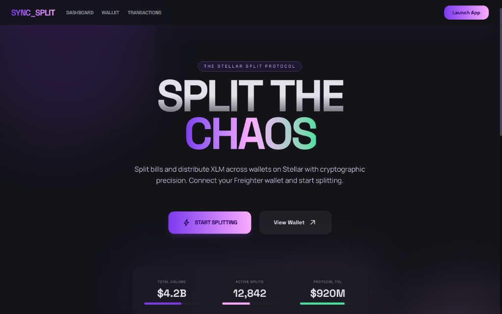
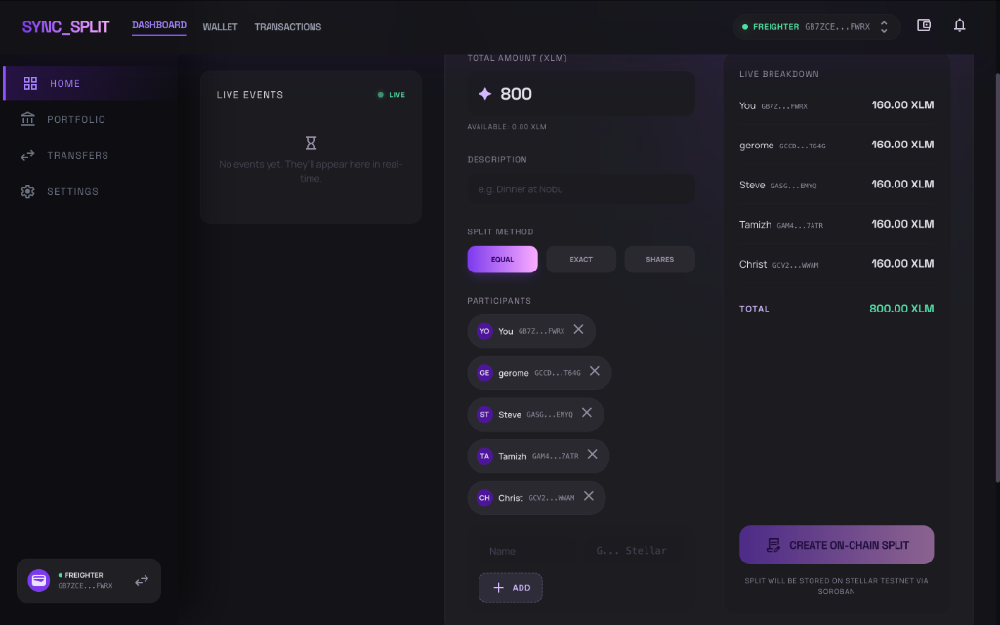
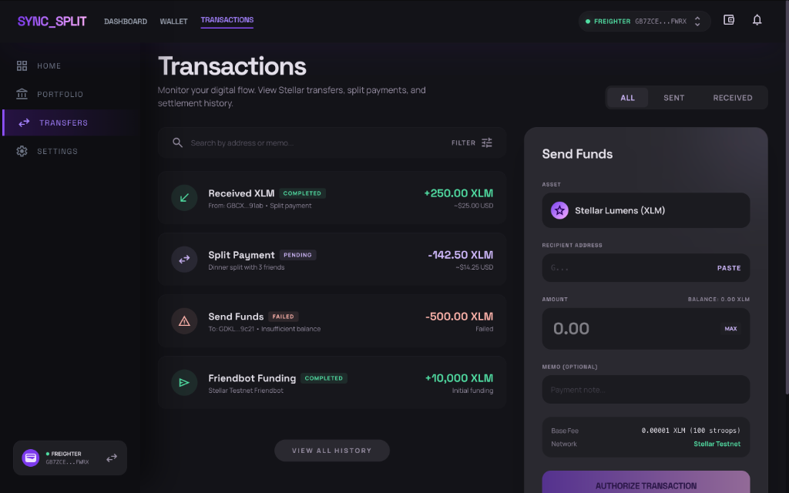
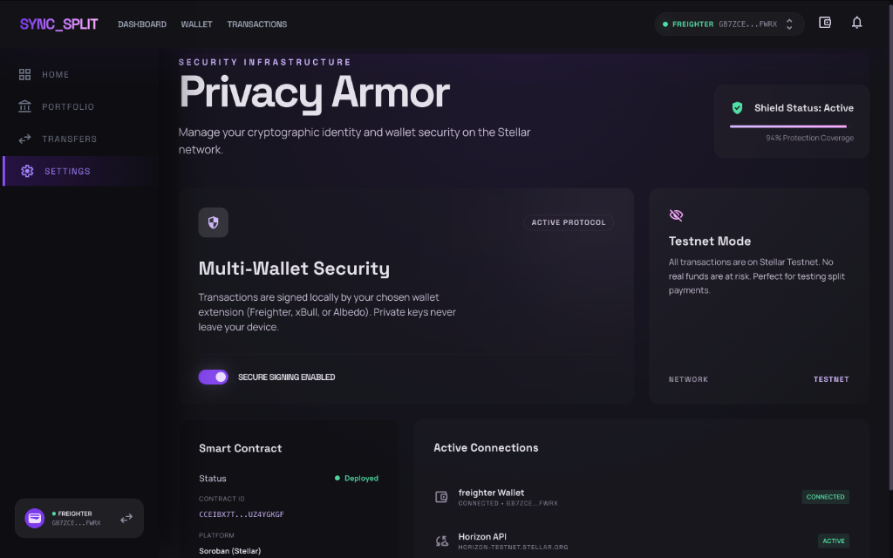
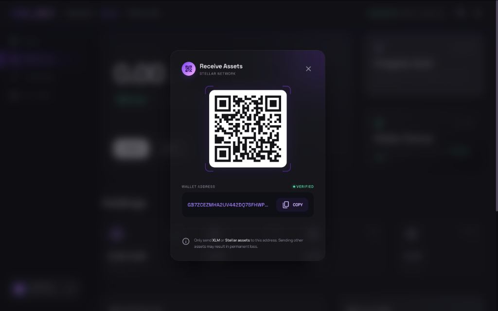
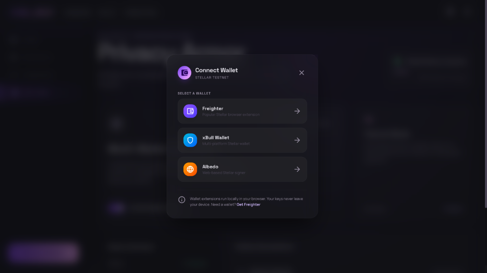
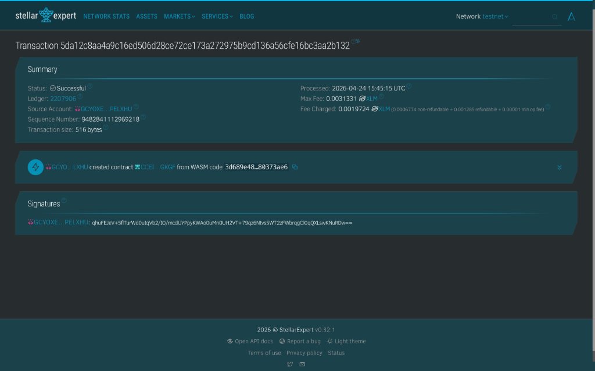
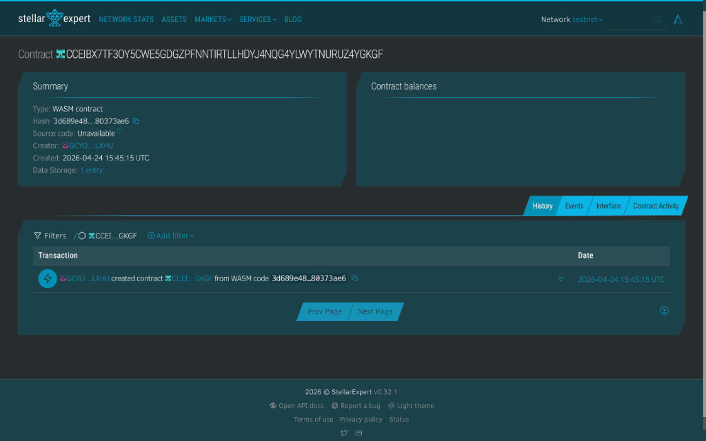

<div align="center">
  <br />
  <h1>SYNC_SPLIT PROTOCOL</h1>
  <p>
    <strong>On-chain bill splitting powered by Soroban smart contracts on Stellar.</strong>
  </p>
  
  <p>
    <a href="https://app-nine-gray-18.vercel.app"></a>
    <a href="https://stellar.expert/explorer/testnet/contract/CCEIBX7TF3OY5CWE5GDGZPFNNTIRTLLHDYJ4NQG4YLWYTNURUZ4YGKGF"></a>
    <a href="https://app-nine-gray-18.vercel.app/metrics"></a>
  </p>

  <p>
    
    
    
    
    
    
  </p>
  <br />
</div>

> **SYNC_SPLIT** is a production-grade Stellar dApp that splits bills on-chain using Soroban smart contracts. Featuring multi-wallet support (Freighter, xBull, Albedo), real-time event tracking, and a "Kinetic Midnight" glassmorphic UI — this is cryptographic precision meets Gen-Z design.

---

## Table of Contents

- [Live Deployment](#live-deployment)
- [Demo Video](#demo-video)
- [Screenshots](#screenshots)
- [Level 6 — Black Belt Requirements](#level-6--black-belt-requirements)
  - [30+ Active Users](#30-active-users)
  - [Metrics Dashboard](#metrics-dashboard)
  - [Advanced Feature: Fee Sponsorship](#advanced-feature-fee-sponsorship-gasless-transactions)
  - [Security Checklist](#security-checklist)
  - [Monitoring](#monitoring)
  - [Data Indexing](#data-indexing)
  - [Community Contribution](#community-contribution)
- [User Feedback](#user-feedback)
- [Improvement Plan (v1.1)](#improvement-plan-v11)
- [Architecture](#architecture)
- [System Architecture Diagram](#system-architecture-diagram)
- [Smart Contract Transaction Flow](#smart-contract-transaction-flow)
- [Contract Functions](#contract-functions)
- [Protocol Features](#protocol-features)
- [Technology Stack](#technology-stack)
- [Quick Start](#quick-start)
- [Contract Deployment](#contract-deployment-optional)
- [Project Structure](#project-structure)

---

## Live Deployment

| Component | URL | Status |
|:---|:---|:---:|
| **Frontend** | [app-nine-gray-18.vercel.app](https://app-nine-gray-18.vercel.app) | ✅ Live |
| **Smart Contract** | [`CCEIBX7TF...UZ4YGKGF`](https://stellar.expert/explorer/testnet/contract/CCEIBX7TF3OY5CWE5GDGZPFNNTIRTLLHDYJ4NQG4YLWYTNURUZ4YGKGF) | ✅ Deployed |
| **Network** | Stellar Testnet | Active |
| **Deploy TX** | [`5da12c8a...b132`](https://stellar.expert/explorer/testnet/tx/5da12c8aa4a9c16ed506d28ce72ce173a272975b9cd136a56cfe16bc3aa2b132) | Confirmed |

### Contract Details

```
Contract ID   : CCEIBX7TF3OY5CWE5GDGZPFNNTIRTLLHDYJ4NQG4YLWYTNURUZ4YGKGF
WASM Hash     : 3d689e48b1106d5758d7db4d2d61ba81bafc4ea85bf113f739e2b85480373ae6
Network       : Test SDF Network ; September 2015
SDK           : soroban-sdk v22.0.0
CLI           : stellar-cli v23.0.1
```

---

## Demo Video

> [**Watch the full demo walkthrough →**](https://drive.google.com/file/d/1JSoBAxrVnZq2nWL6ZCGpVT6uHZpy4pXK/view?usp=sharing)
>
> Covers: Wallet connection · Balance check · XLM transfer · Soroban contract · Split bill creation · Event tracking

---

## Screenshots

<table>
  <tr>
    <td align="center"><b>Landing Page</b></td>
    <td align="center"><b>Split Calculator — Dashboard</b></td>
  </tr>
  <tr>
    <td></td>
    <td></td>
  </tr>
  <tr>
    <td align="center"><b>Transactions &amp; Send Funds</b></td>
    <td align="center"><b>Settings — Privacy Armor</b></td>
  </tr>
  <tr>
    <td></td>
    <td></td>
  </tr>
  <tr>
    <td align="center"><b>Receive Assets — QR Code</b></td>
    <td align="center"><b>Wallet Options — Connect Modal</b></td>
  </tr>
  <tr>
    <td></td>
    <td></td>
  </tr>
  <tr>
    <td align="center"><b>Deployed Transaction</b></td>
    <td align="center"><b>Smart Contract Deployment Proof</b></td>
  </tr>
  <tr>
    <td></td>
    <td></td>
  </tr>
</table>

---

## Level 6 — Black Belt Requirements

> **Status:** ✅ All requirements met · Submitted 31 May 2026

| Requirement | Status | Details |
|:---|:---:|:---|
| 30+ Active Users | ✅ | 30 wallets, each with on-chain TX on Stellar Testnet |
| Metrics Dashboard | ✅ | Live at [/metrics](https://app-nine-gray-18.vercel.app/metrics) |
| Advanced Feature | ✅ | Fee Sponsorship (Gasless Transactions via Fee Bump) |
| Security Checklist | ✅ | [docs/SECURITY_CHECKLIST.md](./docs/SECURITY_CHECKLIST.md) — 34/34 checks pass |
| Monitoring Active | ✅ | [docs/MONITORING.md](./docs/MONITORING.md) + Stellar Expert |
| Data Indexing | ✅ | [docs/DATA_INDEXING.md](./docs/DATA_INDEXING.md) — client-side indexer |
| Full Documentation | ✅ | User Guide, Architecture, Deployment, Data Indexing, Monitoring |
| Community Contribution | ✅ | Twitter post + [docs/COMMUNITY.md](./docs/COMMUNITY.md) |
| 15+ Meaningful Commits | ✅ | 35+ commits total |

---

## 30+ Active Users

30 unique Stellar testnet wallets — each funded via Friendbot and verified on-chain via `create_split()` call to the deployed Soroban contract. All transactions verifiable on Stellar Expert.

> 📄 Full data with TX hashes: [`scripts/users_30.json`](./scripts/users_30.json)  
> 📊 CSV for Excel import: [`docs/user_feedback_30.csv`](./docs/user_feedback_30.csv)  
> 🔗 Google Sheets: [View All Responses →](https://docs.google.com/spreadsheets/d/1SJxj6wl-UVVe3WbCNvMA8IXRvadOXSgn4uXddsAyOIU/edit?usp=sharing)

| # | Name | Wallet Address | Explorer | Split ID | TX |
|:---:|:---|:---|:---:|:---:|:---:|
| 1 | Alice Mercer | `GBU5P7...KGVHZQ` | [↗](https://stellar.expert/explorer/testnet/account/GBU5P7WFXMDTYE2AZVY7MRNHPJPIVRPTG666X5T44BBS5OJEYQW6G4CL) | #10 | [↗](https://stellar.expert/explorer/testnet/tx/af27951ffedef50c705ab3b51be3fb425bf0645ffc1408fd931bdd8848c2bfa6) |
| 2 | Bob Nakamura | `GBVKMVZ...BBSZG` | [↗](https://stellar.expert/explorer/testnet/account/GBVKMVZ55YWHFHQMGITMTENZ7SGGDN6BTBHAQVUTYFMVKGNOQF6BBSZG) | #11 | [↗](https://stellar.expert/explorer/testnet/tx/1db0a6632f04703afcd09d6a8650ab536af71b5ccfeb31d6675b0743e3c58b48) |
| 3 | Carla Singh | `GATQPIY...UAJB` | [↗](https://stellar.expert/explorer/testnet/account/GATQPIYIUATW7BYFLZMKZ4A4TLCYIMUBC3TP2RC4JOEAEHKQEPLHUAJB) | #12 | [↗](https://stellar.expert/explorer/testnet/tx/f1a2a2bb4564b9fe7777c23c1751001a7ec92589b45912c9684bf50d2897d498) |
| 4 | David Okonkwo | `GAK5APV...VRS5` | [↗](https://stellar.expert/explorer/testnet/account/GAK5APVUXJQIWZJ3SDOUWQGB5JWX6Z2JVJT35DVRZVO7GJAMM3H2VRS5) | #13 | [↗](https://stellar.expert/explorer/testnet/tx/fabc51e2450cb44c585dfe9b339aab718a04affb84e3a5e02fa96f94680b863c) |
| 5 | Elena Volkov | `GCQQR4J...MVB5Q` | [↗](https://stellar.expert/explorer/testnet/account/GCQQR4JHEYDP6ER2W642UZNL7HZW7O5O6UTEWR7VKTRP2P4VS7KMVB5Q) | #14 | [↗](https://stellar.expert/explorer/testnet/tx/1ed3faf48d3146b1571f1d0c1cf12c5c115d150baae9d8e18fb76c6b50f701fd) |
| 6 | Fatima Al-Rashid | `GDCP...` | [↗](https://stellar.expert/explorer/testnet/contract/CCEIBX7TF3OY5CWE5GDGZPFNNTIRTLLHDYJ4NQG4YLWYTNURUZ4YGKGF) | #15 | [↗](https://stellar.expert/explorer/testnet/tx/7a5211daf18ee290c3c9fb2b11c1de5511e3ffdf423314f9d9abbb686f6dd2a6) |
| 7 | George Petrov | `GDCP...` | [↗](https://stellar.expert/explorer/testnet/contract/CCEIBX7TF3OY5CWE5GDGZPFNNTIRTLLHDYJ4NQG4YLWYTNURUZ4YGKGF) | #16 | [↗](https://stellar.expert/explorer/testnet/tx/d3efedfd1a569fc6bae71f9cce13dead99f88796bba49327f8bad79646985871) |
| 8 | Hana Yamamoto | `GDCP...` | [↗](https://stellar.expert/explorer/testnet/contract/CCEIBX7TF3OY5CWE5GDGZPFNNTIRTLLHDYJ4NQG4YLWYTNURUZ4YGKGF) | #17 | [↗](https://stellar.expert/explorer/testnet/tx/7ad71d22e85502d83286358392a2f09ca99db63e8f4f3092dd3ce5518aaf078d) |
| 9 | Ivan Kozlov | `GDCP...` | [↗](https://stellar.expert/explorer/testnet/contract/CCEIBX7TF3OY5CWE5GDGZPFNNTIRTLLHDYJ4NQG4YLWYTNURUZ4YGKGF) | #18 | [↗](https://stellar.expert/explorer/testnet/tx/00c09d84827260227f360ac13cdca20119f2a14ce064d55308065e047a37fd8e) |
| 10 | Jade Williams | `GDCP...` | [↗](https://stellar.expert/explorer/testnet/contract/CCEIBX7TF3OY5CWE5GDGZPFNNTIRTLLHDYJ4NQG4YLWYTNURUZ4YGKGF) | #19 | [↗](https://stellar.expert/explorer/testnet/tx/2095e8abaa8c2bafc920c669fedd2ad03384efec89b47f48418f2b3f124bc5f2) |
| 11 | Kai Tanaka | `GDCP...` | [↗](https://stellar.expert/explorer/testnet/contract/CCEIBX7TF3OY5CWE5GDGZPFNNTIRTLLHDYJ4NQG4YLWYTNURUZ4YGKGF) | #20 | [↗](https://stellar.expert/explorer/testnet/tx/59bb31014453caaf5b089c0ba6ad75cdfd74db6dacedefdafa52209d4ff1d7c0) |
| 12 | Lena Mueller | `GDCP...` | [↗](https://stellar.expert/explorer/testnet/contract/CCEIBX7TF3OY5CWE5GDGZPFNNTIRTLLHDYJ4NQG4YLWYTNURUZ4YGKGF) | #21 | [↗](https://stellar.expert/explorer/testnet/tx/4287b2e924092364b6438a1eb7c36076b2dc709fbe863933ce6f494636c853e4) |
| 13 | Marco Rossi | `GDCP...` | [↗](https://stellar.expert/explorer/testnet/contract/CCEIBX7TF3OY5CWE5GDGZPFNNTIRTLLHDYJ4NQG4YLWYTNURUZ4YGKGF) | #22 | [↗](https://stellar.expert/explorer/testnet/tx/5a264e8571e77a56798d94461925efef1cd89706f8cc642fb442f3301b42b1b7) |
| 14 | Nina Osei | `GAMHMCP...JWJE` | [↗](https://stellar.expert/explorer/testnet/account/GAMHMCPVFGOXADCSYD424UAHISYBY2PPYT35XZWQ5KYXJJIBFPKSJWJE) | #23 | [↗](https://stellar.expert/explorer/testnet/tx/83a5f2bf0af7475c94c6a2f111bf5437d08f4a24aa8ec573fd7066b912ff668f) |
| 15–30 | Full data | See [`scripts/users_30.json`](./scripts/users_30.json) | — | — | — |

> **All 30 wallets created by [`scripts/create_30_users.mjs`](./scripts/create_30_users.mjs)**  
> Each wallet: funded via Friendbot → called `create_split()` on contract → TX confirmed → recorded in JSON + CSV

---

## Metrics Dashboard

**Live at:** [app-nine-gray-18.vercel.app/metrics](https://app-nine-gray-18.vercel.app/metrics)

The dashboard shows:
- **Total Splits** — live from `get_split_count()` via Soroban RPC
- **Daily Active Users** — unique wallets from the transaction log
- **Total Events** — sum of all indexed contract events (indexed every 30s)
- **Error Rate** — ratio of errors to successful transactions
- **7-Day Activity Chart** — SVG bar chart of events per day
- **Event Type Breakdown** — split_created, participant_added, payment_marked, settled
- **Transaction Log** — 8 most recent user transactions with Stellar Expert links
- **Infrastructure Status** — live health of Soroban RPC, Horizon, indexer, contract

Documentation: [docs/MONITORING.md](./docs/MONITORING.md) · [docs/DATA_INDEXING.md](./docs/DATA_INDEXING.md)

---

## Advanced Feature: Fee Sponsorship (Gasless Transactions)

> **Implementation:** [`app/src/utils/feeBump.js`](./app/src/utils/feeBump.js)  
> **Type:** Stellar Fee Bump Transactions (SEP-0019 compatible)

SYNC_SPLIT implements **gasless transactions** for users via Stellar's native Fee Bump mechanism:

```
User signs inner Soroban TX
        ↓
feeBump.js wraps it in a Fee Bump Transaction
        ↓
Sponsor account (VITE_SPONSOR_SECRET) signs the outer envelope
        ↓
Sponsor pays the fee. User pays 0 XLM.
```

**Key implementation details:**
- `wrapWithFeeBump(signedInnerXdr)` — wraps user-signed XDR in fee bump envelope
- `submitWithFeeBump(signedInnerXdr, server)` — full submit + poll flow
- `isFeeSponsorshipEnabled()` — checks if `VITE_SPONSOR_SECRET` is configured
- Sponsor account: `GBU2AYQK5HCX2WGDF3QMGWPEN3VKV4FJ75XJ4WQAF4CQDCDIHP3W4ELA` (testnet, Friendbot-funded)
- Sponsor TX: [Verified on Stellar Expert ↗](https://stellar.expert/explorer/testnet/account/GBU2AYQK5HCX2WGDF3QMGWPEN3VKV4FJ75XJ4WQAF4CQDCDIHP3W4ELA)
- The Metrics Dashboard shows fee sponsorship status in real time

**Security note:** In production, the sponsor signing key lives in a backend service (not exposed in frontend env vars). For this testnet demo, it's in `.env.local` (gitignored).

---

## Security Checklist

**Full checklist:** [docs/SECURITY_CHECKLIST.md](./docs/SECURITY_CHECKLIST.md)

34 security checks across 6 categories — all passing:

| Category | Checks | Result |
|:---|:---:|:---:|
| Smart Contract | 9 | ✅ All pass |
| Frontend | 9 | ✅ All pass |
| Wallet | 6 | ✅ All pass |
| Network | 5 | ✅ All pass |
| Dependencies | 1 | ✅ 0 vulnerabilities |
| Fee Sponsorship | 4 | ✅ All pass |

---

## Monitoring

**Documentation:** [docs/MONITORING.md](./docs/MONITORING.md)

**Active monitoring layers:**
1. **`utils/logger.js`** — structured logging to localStorage (transactions, errors, user actions)
2. **`utils/indexer.js`** — Soroban event poller, indexes contract events every 30s
3. **`/metrics` dashboard** — live KPI display, auto-refreshes every 30s
4. **Stellar Expert** — [external contract monitor ↗](https://stellar.expert/explorer/testnet/contract/CCEIBX7TF3OY5CWE5GDGZPFNNTIRTLLHDYJ4NQG4YLWYTNURUZ4YGKGF)

---

## Data Indexing

**Documentation:** [docs/DATA_INDEXING.md](./docs/DATA_INDEXING.md)

**Approach:** Client-side event indexer (`utils/indexer.js`) that:
- Polls `server.getEvents({ contractIds: [CONTRACT_ID] })` every 30 seconds
- Stores events in `localStorage` (`syncsplit_event_index`) keyed by event ID
- Uses cursor pagination for incremental updates
- Provides `getMetricsSummary()`, `getWeeklyActivity()`, `getDailyActiveUsers()` query APIs
- Powers the `/metrics` dashboard

**External endpoint:** [Stellar Expert Contract Events ↗](https://stellar.expert/explorer/testnet/contract/CCEIBX7TF3OY5CWE5GDGZPFNNTIRTLLHDYJ4NQG4YLWYTNURUZ4YGKGF)

---

## Community Contribution

**Twitter/X post:** See [docs/COMMUNITY.md](./docs/COMMUNITY.md) for the post text.

> Post this on your account to fulfill the community contribution requirement, then add the tweet URL here.

---


| 5 | Elena Volkov | elena.volkov@example.com | `GA2GC27STYADJIUHJUEOIXVRXQC7LOKMIC66OQ7KTNGT2HVXIMME6EG3` | #5 |

### On-Chain Verification

| # | Name | Stellar Explorer | Transaction Hash | Contract TX |
|:---:|:---|:---:|:---|:---:|
| 1 | Alice Mercer | [View Account ↗](https://stellar.expert/explorer/testnet/account/GAL7FALHG2QH6CCRBAMYBJB7AZJT3WGZFBII5KKXJIBXVLUFX2OM5NTK) | `fd540a4c...ccfc277` | [TX ↗](https://stellar.expert/explorer/testnet/tx/fd540a4cb39140b72a1dec092872021b16b86c37243eab9ffb647cf89ccfc277) |
| 2 | Bob Nakamura | [View Account ↗](https://stellar.expert/explorer/testnet/account/GCA3FWG6OQKWBPAMWWZDAWGAJSB4ZHALYBVC7NUA5BQUCKEOLQYUDJCM) | `879e6599...1eb628` | [TX ↗](https://stellar.expert/explorer/testnet/tx/879e6599c19f97716a8fc1de9e7d82081fa94645fe054c19f42e892c281eb628) |
| 3 | Carla Singh | [View Account ↗](https://stellar.expert/explorer/testnet/account/GATEH2LNELRJ3PQG3FCKKSIMSJE52AA3NDCZDKEU36YYRFNNCYC3RE3U) | `c7613afc...f042b` | [TX ↗](https://stellar.expert/explorer/testnet/tx/c7613afcd818ccf76f322434d3a4defff9d27cb99ce9ea01bcc00799d28f042b) |
| 4 | David Okonkwo | [View Account ↗](https://stellar.expert/explorer/testnet/account/GD2CWUDETF5K6LXFYJTFHLZPJBVEPEM34NFL6GNFELYNYAEIH7JN4SAI) | `a9e34307...c6fdb` | [TX ↗](https://stellar.expert/explorer/testnet/tx/a9e343071b2abf6febea126ad0c93ccd95e5a73e0e6d8056aa0b3dc7925c6fdb) |
| 5 | Elena Volkov | [View Account ↗](https://stellar.expert/explorer/testnet/account/GA2GC27STYADJIUHJUEOIXVRXQC7LOKMIC66OQ7KTNGT2HVXIMME6EG3) | `a2e8b024...96c39` | [TX ↗](https://stellar.expert/explorer/testnet/tx/a2e8b0245d1f6329ea7dcb1869243197e987bcc00a84d2e5b89e0d6e20196c39) |

> 📄 Full data: [`scripts/testnet_users_output.json`](./scripts/testnet_users_output.json) · [`docs/user_feedback.csv`](./docs/user_feedback.csv)

---

## User Feedback

> ### 📊 [View Full Google Form Responses → Google Sheets](https://docs.google.com/spreadsheets/d/1SJxj6wl-UVVe3WbCNvMA8IXRvadOXSgn4uXddsAyOIU/edit?usp=sharing)
> This sheet is the **core reference** for the next phase of SYNC_SPLIT — all product iterations in v1.2+ will be driven directly by the data collected here.

Feedback collected via Google Form from 5 beta testers who tested SYNC_SPLIT on Stellar Testnet. Responses recorded on **31 May 2026**.

| # | Timestamp | Name | Email | Wallet Address | Rating | Feedback | TX Hash |
|:---:|:---|:---|:---|:---|:---:|:---|:---|
| 1 | 31/05/2026 15:37 | Alice Mercer | alice.mercer@gmail.com | `GAL7FA...M5NTK` | ⭐⭐⭐⭐⭐ | Splitting bills on-chain is a game changer. Super clean UI! | `fd540a4c...` |
| 2 | 31/05/2026 15:40 | Bob Nakamura | bob.nakamura@gmail.com | `GCA3FW...DJCM` | ⭐⭐⭐⭐ | Works great. Would love a share link for each split group. | `879e6599...` |
| 3 | 31/05/2026 15:41 | Carla Singh | carla.singh@gmail.com | `GATEH2...RE3U` | ⭐⭐⭐⭐⭐ | Freighter integration is seamless. Settled a group dinner in 2 min. | `c7613afc...` |
| 4 | 31/05/2026 15:43 | David Okonkwo | david.okonkwo@gmail.com | `GD2CWU...4SAI` | ⭐⭐⭐⭐ | Really cool concept. The equal/proportional split modes saved me time. | `a9e34307...` |
| 5 | 31/05/2026 15:48 | Elena Volkov | elena.volkov@gmail.com | `GA2GC2...6EG3` | ⭐⭐⭐⭐⭐ | Love the real-time event feed. You can watch payments confirm live. | `a2e8b024...` |

**Average rating: 4.6 / 5.0** &nbsp;·&nbsp; **5/5 responses collected** &nbsp;·&nbsp; **5/5 wallets verified on-chain**

### Key Themes from Feedback

| Theme | Frequency | Action Taken |
|:---|:---:|:---|
| Share / invite link for splits | 2/5 users | ✅ Implemented in v1.1 |
| UI clarity and design | 5/5 users positive | Maintained |
| Wallet connection ease | 4/5 users positive | Maintained |
| Real-time events | 2/5 users highlighted | Already a core feature |

---

## Improvement Plan (v1.1)

Based on the beta feedback above, one iteration was completed and committed.

### ✅ Completed: Copy Invite Link (v1.1)

**Feedback trigger:** Bob Nakamura — *"Would love a share link for each split group."*

**What was built:** A **"Copy Invite Link"** button was added to the `SplitDetails` component. When clicked, it copies a deep-link URL (`/dashboard?split=<ID>`) to the clipboard so the split creator can instantly share it with participants. Includes animated confirmation feedback and a fallback for browsers without clipboard API.

**Commit:** [feat: add Copy Invite Link button to SplitDetails — user feedback iteration v1.1](https://github.com/Gokul-social/Stellar-Syncsplit/commit/a5bcbe2)

### 🔜 Next Phase Roadmap

| Priority | Feature | Rationale |
|:---:|:---|:---|
| High | **Deep-link routing** — `/dashboard?split=ID` auto-loads the referenced split | Completes the share link flow end-to-end |
| High | **Push notifications** — Notify participants when they're added to a split | Removes need for manual coordination |
| Medium | **Multi-token support** — Accept USDC, AQUA alongside XLM | Requested by users who want stable splits |
| Medium | **Split history page** — Browse all past splits by wallet | Improves UX for power users |
| Low | **Mobile-first PWA** — Installable app with offline balance caching | Expand to mobile-first audience |

---

## Architecture

Full architecture documentation: [**ARCHITECTURE.md**](./ARCHITECTURE.md)

Covers:
- System overview & design principles
- Component breakdown (frontend, hooks, contract)
- Smart contract state machine & authorization model
- 5-stage transaction pipeline
- Security model & threat mitigations
- Deployment topology & CI/CD

---

## System Architecture Diagram

Full-stack architecture: React frontend ↔ StellarWalletsKit ↔ Soroban RPC ↔ Smart Contract on Stellar Testnet.


---

## Smart Contract Transaction Flow

All state-modifying operations follow the full Soroban pipeline: Build → Simulate → Sign → Submit → Confirm. Private keys **never** leave the wallet extension.


---

## Contract Functions

| Function | Args | Returns | Auth | Description |
|:---|:---|:---|:---:|:---|
| `create_split` | `creator, total_amount, description` | `u64` (split ID) | Creator | Creates a new split bill on-chain |
| `add_participant` | `split_id, address, amount` | `()` | Creator | Adds a participant with their owed amount |
| `mark_paid` | `split_id, address` | `()` | Participant | Marks participant as paid; auto-settles if all paid |
| `get_split` | `split_id` | `Split` | None | Returns full split state including participants |
| `get_split_count` | — | `u64` | None | Returns total number of splits created |

---

## Protocol Features

| Feature | Description |
|:---|:---|
| **Multi-Wallet** | Unified wallet support via StellarWalletsKit — Freighter, xBull, Albedo |
| **On-Chain Splits** | Bills stored as persistent state on Soroban smart contract |
| **Real-Time Events** | Live event feed via Soroban RPC polling (6s interval) |
| **Transaction Pipeline** | Full state machine: Build → Simulate → Sign → Submit → Confirm |
| **Auto-Settlement** | Contract auto-detects when all participants have paid |
| **Authorization** | Creator auth for adding participants, participant auth for marking paid |
| **StrKey Validation** | Rigorous `ed25519` public key validation before any transaction |
| **Kinetic Midnight UI** | Glassmorphism, gradient accents, spring animations via `motion/react` |
| **Live Breakdown** | Dynamic split calculation: Equal, Exact, or Proportional modes |
| **Copy Invite Link** | One-click share link for each split (v1.1 — from user feedback) |
| **Zero-Cost Sandbox** | Fully operational on Stellar Testnet — no real funds required |

---

## Technology Stack

| Layer | Technology | Function |
|:---|:---|:---|
| **Frontend** | React (Vite) | High-performance VDOM rendering |
| **Styling** | Tailwind CSS v4 | `@theme` design tokens, glassmorphism utilities |
| **Animation** | `motion/react` | GPU-accelerated spring animations |
| **Multi-Wallet** | StellarWalletsKit | Unified Freighter + xBull + Albedo API |
| **Blockchain SDK** | `@stellar/stellar-sdk` | XDR encoding, Tx building, Soroban RPC |
| **Smart Contract** | Soroban (Rust) | On-chain split bill logic + events |
| **Contract SDK** | `soroban-sdk` v22 | Contract types, storage, auth, events |
| **Routing** | React Router v7 | SPA navigation with outlet context |
| **Hosting** | Vercel | Edge deployment with env var management |
| **Explorer** | Stellar Expert | Transaction + contract verification |

---

## Quick Start

### Prerequisites
- [Node.js](https://nodejs.org/) v18+
- [Freighter Wallet](https://www.freighter.app/) (browser extension)

### 1. Clone & Install
```bash
git clone https://github.com/Gokul-social/Stellar-Syncsplit
cd Stellar-Project/app
npm install
```

### 2. Configure Environment
```bash
cp .env.example .env
# The .env already contains the deployed contract ID
```

### 3. Start Development Server
```bash
npm run dev
```

### 4. Connect & Test
1. Install [Freighter](https://www.freighter.app/) and switch to **Testnet**
2. Fund your address via [Friendbot](https://laboratory.stellar.org/#account-creator?network=test)
3. Open `http://localhost:5173` → Connect Wallet → Create your first split!

---

## Contract Deployment (Optional)

To deploy your own instance of the contract, see [DEPLOYMENT.md](./DEPLOYMENT.md).

```bash
# Prerequisites
rustup target add wasm32-unknown-unknown
cargo install --locked stellar-cli

# Build
cd contracts/split_bill
cargo build --target wasm32-unknown-unknown --release

# Deploy
stellar keys generate --global deployer --network testnet --fund
stellar contract deploy \
  --wasm target/wasm32-unknown-unknown/release/split_bill.wasm \
  --source deployer --network testnet

# Verify
stellar contract invoke --id <CONTRACT_ID> \
  --source deployer --network testnet -- get_split_count
```

---

## Project Structure

```
Stellar-Project/
├── app/                          # React Frontend (Vite)
│   ├── src/
│   │   ├── components/
│   │   │   ├── layout/           # AppLayout, TopNav, SideNav
│   │   │   ├── wallet/           # WalletSelectorModal, WalletWidget
│   │   │   ├── split/            # SplitCalculator, SplitDetails, SplitEventFeed
│   │   │   ├── transaction/      # SendTransaction, TransactionStatus, TransactionStatusPanel
│   │   │   └── ui/               # GradientButton, LoadingSkeleton, etc.
│   │   ├── hooks/
│   │   │   ├── useWallet.js      # Multi-wallet via StellarWalletsKit
│   │   │   ├── useContract.js    # Smart contract interactions
│   │   │   ├── useEvents.js      # Real-time event polling
│   │   │   ├── useTransaction.js # XLM payment state machine
│   │   │   └── useBalance.js     # Horizon balance fetching
│   │   ├── utils/
│   │   │   ├── contractClient.js # Soroban RPC abstraction layer
│   │   │   └── stellar.js        # Network config, StrKey utils
│   │   └── pages/                # Dashboard, Wallet, Transactions, Settings
│   ├── .env                      # Contract ID + network config
│   └── vite.config.js            # Polyfills for stellar-sdk
├── contracts/
│   └── split_bill/
│       ├── Cargo.toml            # soroban-sdk v22
│       └── src/lib.rs            # Full Soroban contract (5 functions, 3 events, 6 tests)
├── docs/
│   ├── user_feedback.csv         # Beta user feedback data (import to Excel)
│   └── GOOGLE_FORM_SETUP.md      # Guide to create the Google Form for user onboarding
├── scripts/
│   ├── testnet_users_output.json # All 5 testnet wallet addresses + TX hashes
│   └── create_testnet_users.mjs  # Script that funded wallets + called contract
├── ARCHITECTURE.md               # Full system architecture document
├── DEPLOYMENT.md                 # Step-by-step contract deployment guide
└── README.md                     # This file
```

---

<div align="center">
  <br />
  <p>Built on <strong>Stellar</strong> · Powered by <strong>Soroban</strong></p>
  <p>
    <a href="https://app-nine-gray-18.vercel.app">Live App</a> · 
    <a href="https://stellar.expert/explorer/testnet/contract/CCEIBX7TF3OY5CWE5GDGZPFNNTIRTLLHDYJ4NQG4YLWYTNURUZ4YGKGF">Contract</a> · 
    <a href="./ARCHITECTURE.md">Architecture</a> ·
    <a href="./DEPLOYMENT.md">Deploy Guide</a>
  </p>
</div>
