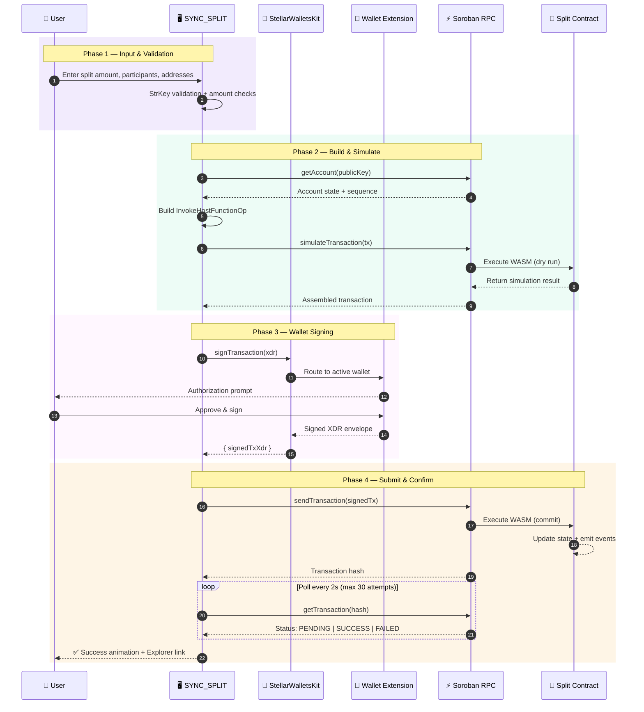
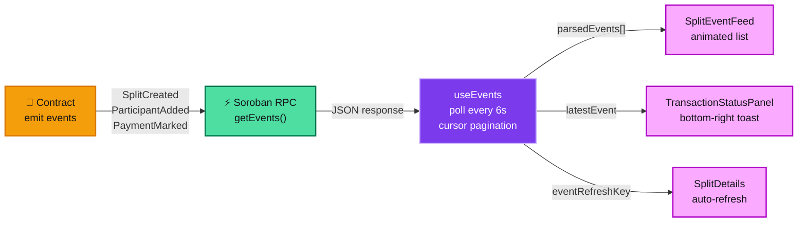

<div align="center">
  <br />
  <h1>⚡ SYNC_SPLIT PROTOCOL</h1>
  <p>
    <strong>On-chain bill splitting powered by Soroban smart contracts on Stellar.</strong>
  </p>
  
  <p>
    <a href="https://app-nine-gray-18.vercel.app"></a>
    <a href="https://stellar.expert/explorer/testnet/contract/CCEIBX7TF3OY5CWE5GDGZPFNNTIRTLLHDYJ4NQG4YLWYTNURUZ4YGKGF"></a>
  </p>

  <p>
    
    
    
    
    
    
  </p>
  <br />
</div>

> **SYNC_SPLIT** is a production-grade Level 2 Stellar dApp that splits bills on-chain using Soroban smart contracts. Featuring multi-wallet support (Freighter, xBull, Albedo), real-time event tracking, and a "Kinetic Midnight" glassmorphic UI — this is cryptographic precision meets Gen-Z design.

---

## 🌐 Live Deployment

| Component | URL | Status |
|:---|:---|:---:|
| **Frontend** | [app-nine-gray-18.vercel.app](https://app-nine-gray-18.vercel.app) | ✅ Live |
| **Smart Contract** | [`CCEIBX7TF...UZ4YGKGF`](https://stellar.expert/explorer/testnet/contract/CCEIBX7TF3OY5CWE5GDGZPFNNTIRTLLHDYJ4NQG4YLWYTNURUZ4YGKGF) | ✅ Deployed |
| **Network** | Stellar Testnet | ✅ Active |
| **Deploy TX** | [`5da12c8a...b132`](https://stellar.expert/explorer/testnet/tx/5da12c8aa4a9c16ed506d28ce72ce173a272975b9cd136a56cfe16bc3aa2b132) | ✅ Confirmed |

### Contract Details

```
Contract ID   : CCEIBX7TF3OY5CWE5GDGZPFNNTIRTLLHDYJ4NQG4YLWYTNURUZ4YGKGF
WASM Hash     : 3d689e48b1106d5758d7db4d2d61ba81bafc4ea85bf113f739e2b85480373ae6
Network       : Test SDF Network ; September 2015
SDK           : soroban-sdk v22.0.0
CLI           : stellar-cli v23.0.1
```
## 📸 Screenshots

<table>
  <tr>
    <td align="center"><b>🏠 Landing Page</b></td>
    <td align="center"><b>📊 Dashboard — Split Calculator</b></td>
  </tr>
  <tr>
    <td></td>
    <td></td>
  </tr>
  <tr>
    <td align="center"><b>💰 Wallet & Portfolio</b></td>
    <td align="center"><b>💸 Send Transaction</b></td>
  </tr>
  <tr>
    <td></td>
    <td></td>
  </tr>
  <tr>
    <td align="center"><b>📜 Transaction History</b></td>
    <td align="center"><b>📜 Deployed Contract — Stellar Expert</b></td>
  </tr>
  <tr>
    <td></td>
    <td></td>
  </tr>
  <tr>
    <td align="center" colspan="2"><b>✅ Transaction Confirmation — Stellar Expert</b></td>
  </tr>
  <tr>
    <td align="center" colspan="2"></td>
  </tr>
</table>

---


---

## 🏗️ System Architecture

Full-stack architecture: React frontend ↔ StellarWalletsKit ↔ Soroban RPC ↔ Smart Contract on Stellar Testnet.

```mermaid
graph TB
    classDef frontend fill:#7c3aed,stroke:#d2bbff,stroke-width:2px,color:#fff;
    classDef wallet fill:#fbabff,stroke:#ae05c6,stroke-width:2px,color:#131318;
    classDef rpc fill:#4edea2,stroke:#007650,stroke-width:2px,color:#131318;
    classDef contract fill:#f59e0b,stroke:#d97706,stroke-width:2px,color:#131318;

    subgraph BROWSER ["🖥️ Browser Environment"]
        direction TB
        UI["React + Tailwind v4 + Motion"]:::frontend
        HOOKS["useWallet · useContract · useEvents · useTransaction"]:::frontend
        SWK["StellarWalletsKit"]:::frontend
        CLIENT["contractClient.js · stellar.js"]:::frontend
    end

    subgraph WALLETS ["🔐 Wallet Extensions"]
        direction LR
        FR["Freighter"]:::wallet
        XB["xBull"]:::wallet
        AL["Albedo"]:::wallet
    end

    subgraph STELLAR ["⭐ Stellar Testnet Infrastructure"]
        direction TB
        SOROBAN_RPC["Soroban RPC Server"]:::rpc
        HORIZON["Horizon REST API"]:::rpc
        CONTRACT["Split Bill Contract (WASM)"]:::contract
        CORE["Stellar Core Consensus"]:::rpc
    end

    UI <--> |"State & Events"| HOOKS
    HOOKS <--> |"Unified API"| SWK
    HOOKS <--> |"Tx Assembly"| CLIENT
    SWK <--> |"Auth / Sign"| FR & XB & AL
    CLIENT --> |"invokeContract"| SOROBAN_RPC
    CLIENT --> |"getEvents (poll 6s)"| SOROBAN_RPC
    CLIENT --> |"getAccount / submit"| HORIZON
    SOROBAN_RPC <--> |"Execute WASM"| CONTRACT
    HORIZON <--> |"Ledger Updates"| CORE
    CONTRACT -.- |"Stored on"| CORE

    style BROWSER fill:#131318,stroke:#35343a,stroke-width:1px,stroke-dasharray:5 5
    style WALLETS fill:#131318,stroke:#35343a,stroke-width:1px,stroke-dasharray:5 5
    style STELLAR fill:#131318,stroke:#35343a,stroke-width:1px,stroke-dasharray:5 5
```



---

## 🔄 Smart Contract Transaction Flow

All state-modifying operations follow the full Soroban pipeline: Build → Simulate → Sign → Submit → Confirm. Private keys **never** leave the wallet extension.



---

## 📜 Smart Contract Architecture

The Soroban contract manages split bills as persistent on-chain state with full authorization and event emission.

```mermaid
graph LR
    classDef fn fill:#7c3aed,stroke:#d2bbff,stroke-width:2px,color:#fff;
    classDef data fill:#1e1b2e,stroke:#35343a,stroke-width:2px,color:#d2bbff;
    classDef event fill:#4edea2,stroke:#007650,stroke-width:2px,color:#131318;

    subgraph CONTRACT ["📜 SplitBillContract"]
        direction TB

        subgraph WRITE ["✏️ Write Functions (require auth)"]
            CS["create_split()"]:::fn
            AP["add_participant()"]:::fn
            MP["mark_paid()"]:::fn
        end

        subgraph READ ["👁️ Read Functions (no auth)"]
            GS["get_split()"]:::fn
            GSC["get_split_count()"]:::fn
        end

        subgraph STORAGE ["💾 Persistent Storage"]
            SPLITS["Split { id, creator, total_amount,<br/>description, participants[], settled }"]:::data
            COUNTER["SplitCounter (u64)"]:::data
        end

        subgraph EVENTS ["📡 Events Emitted"]
            E1["SplitCreated<br/>(split_id, creator, amount)"]:::event
            E2["ParticipantAdded<br/>(split_id, address, amount)"]:::event
            E3["PaymentMarked<br/>(split_id, address)"]:::event
        end
    end

    CS --> |"creates"| SPLITS
    CS --> |"increments"| COUNTER
    CS --> |"emits"| E1
    AP --> |"appends to"| SPLITS
    AP --> |"emits"| E2
    MP --> |"updates"| SPLITS
    MP --> |"emits"| E3
    GS --> |"reads"| SPLITS
    GSC --> |"reads"| COUNTER

    style CONTRACT fill:#131318,stroke:#35343a,stroke-width:1px,stroke-dasharray:5 5
    style WRITE fill:#1a1625,stroke:#7c3aed20,stroke-width:1px
    style READ fill:#1a1625,stroke:#7c3aed20,stroke-width:1px
    style STORAGE fill:#1a1625,stroke:#7c3aed20,stroke-width:1px
    style EVENTS fill:#1a1625,stroke:#7c3aed20,stroke-width:1px
```



### Contract Functions

| Function | Args | Returns | Auth | Description |
|:---|:---|:---|:---:|:---|
| `create_split` | `creator, total_amount, description` | `u64` (split ID) | Creator | Creates a new split bill on-chain |
| `add_participant` | `split_id, address, amount` | `()` | Creator | Adds a participant with their owed amount |
| `mark_paid` | `split_id, address` | `()` | Participant | Marks participant as paid; auto-settles if all paid |
| `get_split` | `split_id` | `Split` | None | Returns full split state including participants |
| `get_split_count` | — | `u64` | None | Returns total number of splits created |

---

## 🏛️ Frontend Component Architecture

```mermaid
graph TB
    classDef page fill:#7c3aed,stroke:#d2bbff,stroke-width:2px,color:#fff;
    classDef comp fill:#1e1b2e,stroke:#7c3aed,stroke-width:1px,color:#d2bbff;
    classDef hook fill:#4edea2,stroke:#007650,stroke-width:2px,color:#131318;
    classDef util fill:#f59e0b,stroke:#d97706,stroke-width:1px,color:#131318;

    subgraph PAGES ["📄 Pages"]
        DP["DashboardPage"]:::page
        WP["WalletPage"]:::page
        TP["TransactionsPage"]:::page
        SP["SettingsPage"]:::page
    end

    subgraph LAYOUT ["🖼️ Layout"]
        AL["AppLayout"]:::comp
        TN["TopNav"]:::comp
        SN["SideNav"]:::comp
    end

    subgraph COMPONENTS ["🧩 Components"]
        direction TB
        SC["SplitCalculator"]:::comp
        SD["SplitDetails"]:::comp
        SEF["SplitEventFeed"]:::comp
        WSM["WalletSelectorModal"]:::comp
        WW["WalletWidget"]:::comp
        ST["SendTransaction"]:::comp
        TSP["TransactionStatusPanel"]:::comp
    end

    subgraph HOOKS ["⚙️ Hooks"]
        UW["useWallet"]:::hook
        UC["useContract"]:::hook
        UE["useEvents"]:::hook
        UT["useTransaction"]:::hook
        UB["useBalance"]:::hook
    end

    subgraph UTILS ["🔧 Utils"]
        CC["contractClient.js"]:::util
        SU["stellar.js"]:::util
    end

    AL --> TN & SN
    AL --> DP & WP & TP & SP
    AL --> WSM & TSP

    DP --> SC & SD & SEF & WW
    TP --> ST
    SC --> UC
    SD --> UC
    SEF --> UE
    WSM --> UW
    WW --> UB
    ST --> UT

    UW --> CC
    UC --> CC
    UE --> CC
    UT --> SU
    CC --> SU

    style PAGES fill:#131318,stroke:#35343a,stroke-width:1px,stroke-dasharray:5 5
    style LAYOUT fill:#131318,stroke:#35343a,stroke-width:1px,stroke-dasharray:5 5
    style COMPONENTS fill:#131318,stroke:#35343a,stroke-width:1px,stroke-dasharray:5 5
    style HOOKS fill:#131318,stroke:#35343a,stroke-width:1px,stroke-dasharray:5 5
    style UTILS fill:#131318,stroke:#35343a,stroke-width:1px,stroke-dasharray:5 5
```



---

## 🎭 Real-Time Event Flow

Events are polled from Soroban RPC every 6 seconds and displayed in the live event feed without page refresh.



---

## ✨ Protocol Features

| Feature | Description |
|:---|:---|
| **🔐 Multi-Wallet** | Unified wallet support via StellarWalletsKit — Freighter, xBull, Albedo |
| **📜 On-Chain Splits** | Bills stored as persistent state on Soroban smart contract |
| **📡 Real-Time Events** | Live event feed via Soroban RPC polling (6s interval) |
| **🔄 Transaction Pipeline** | Full state machine: Build → Simulate → Sign → Submit → Confirm |
| **✅ Auto-Settlement** | Contract auto-detects when all participants have paid |
| **🛡️ Authorization** | Creator auth for adding participants, participant auth for marking paid |
| **🎯 StrKey Validation** | Rigorous `ed25519` public key validation before any transaction |
| **💫 Kinetic Midnight UI** | Glassmorphism, gradient accents, spring animations via `motion/react` |
| **📊 Live Breakdown** | Dynamic split calculation: Equal, Exact, or Proportional modes |
| **🌐 Zero-Cost Sandbox** | Fully operational on Stellar Testnet — no real funds required |

---

## 📦 Technology Stack

| Layer | Technology | Function |
|:---|:---|:---|
| **Frontend** | React (Vite) | High-performance VDOM rendering |
| **Styling** | Tailwind CSS v4 | `@theme` design tokens, glassmorphism utilities |
| **Animation** | `motion/react` | GPU-accelerated spring animations |
| **Multi-Wallet** | StellarWalletsKit | Unified Freighter + xBull + Albedo API |
| **Blockchain SDK** | `@stellar/stellar-sdk` | XDR encoding, Tx building, Soroban RPC |
| **Smart Contract** | Soroban (Rust) | On-chain split bill logic + events |
| **Contract SDK** | `soroban-sdk` v22 | Contract types, storage, auth, events |
| **Routing** | React Router v7 | SPA navigation with outlet context |
| **Hosting** | Vercel | Edge deployment with env var management |
| **Explorer** | Stellar Expert | Transaction + contract verification |

---

## 🚀 Quick Start

### Prerequisites
- [Node.js](https://nodejs.org/) v18+
- [Freighter Wallet](https://www.freighter.app/) (browser extension)

### 1. Clone & Install
```bash
git clone <your-repo-url>
cd Stellar-Project/app
npm install
```

### 2. Configure Environment
```bash
cp .env.example .env
# The .env already contains the deployed contract ID
```

### 3. Start Development Server
```bash
npm run dev
```

### 4. Connect & Test
1. Install [Freighter](https://www.freighter.app/) and switch to **Testnet**
2. Fund your address via [Friendbot](https://laboratory.stellar.org/#account-creator?network=test)
3. Open `http://localhost:5173` → Connect Wallet → Create your first split!

---

## 🔨 Contract Deployment (Optional)

To deploy your own instance of the contract, see [DEPLOYMENT.md](./DEPLOYMENT.md).

```bash
# Prerequisites
rustup target add wasm32-unknown-unknown
cargo install --locked stellar-cli

# Build
cd contracts/split_bill
cargo build --target wasm32-unknown-unknown --release

# Deploy
stellar keys generate --global deployer --network testnet --fund
stellar contract deploy \
  --wasm target/wasm32-unknown-unknown/release/split_bill.wasm \
  --source deployer --network testnet

# Verify
stellar contract invoke --id <CONTRACT_ID> \
  --source deployer --network testnet -- get_split_count
```

---

## 📁 Project Structure

```
Stellar-Project/
├── app/                          # React Frontend (Vite)
│   ├── src/
│   │   ├── components/
│   │   │   ├── layout/           # AppLayout, TopNav, SideNav
│   │   │   ├── wallet/           # WalletSelectorModal, WalletWidget
│   │   │   ├── split/            # SplitCalculator, SplitDetails, SplitEventFeed
│   │   │   ├── transaction/      # SendTransaction, TransactionStatus, TransactionStatusPanel
│   │   │   └── ui/               # GradientButton, LoadingSkeleton, etc.
│   │   ├── hooks/
│   │   │   ├── useWallet.js      # Multi-wallet via StellarWalletsKit
│   │   │   ├── useContract.js    # Smart contract interactions
│   │   │   ├── useEvents.js      # Real-time event polling
│   │   │   ├── useTransaction.js # XLM payment state machine
│   │   │   └── useBalance.js     # Horizon balance fetching
│   │   ├── utils/
│   │   │   ├── contractClient.js # Soroban RPC abstraction layer
│   │   │   └── stellar.js        # Network config, StrKey utils
│   │   └── pages/                # Dashboard, Wallet, Transactions, Settings
│   ├── .env                      # Contract ID + network config
│   └── vite.config.js            # Polyfills for stellar-sdk
├── contracts/
│   └── split_bill/
│       ├── Cargo.toml            # soroban-sdk v22
│       └── src/lib.rs            # Full Soroban contract (5 functions, 3 events, 6 tests)
├── DEPLOYMENT.md                 # Step-by-step contract deployment guide
└── README.md                     # This file
```

---

<div align="center">
  <br />
  <p>Built with 💜 on <strong>Stellar</strong> · Powered by <strong>Soroban</strong></p>
  <p>
    <a href="https://app-nine-gray-18.vercel.app">🚀 Live App</a> · 
    <a href="https://stellar.expert/explorer/testnet/contract/CCEIBX7TF3OY5CWE5GDGZPFNNTIRTLLHDYJ4NQG4YLWYTNURUZ4YGKGF">📜 Contract</a> · 
    <a href="./DEPLOYMENT.md">📖 Deploy Guide</a>
  </p>
</div>
